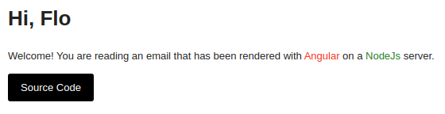

# Requirements

- Linux
- Yarn
- Docker Compose
- Kubectl

# Commands

**Setup**

- Just run: `yarn`
- Then build the project once: `yarn build:dev`
- Then configure secrets in `libs/config/secrets`

**Send Email**

- Start client: `yarn client:ssr`
- Start server: `yarn server`
- Open http://localhost:3000/welcome?name=Someone&email=someone@example.com

# Sent Welcome EMail

http://localhost:3000/welcome?name=Flo&email=my@email.com

# TODO

- make custom fonts work
- make k8s deployment work
